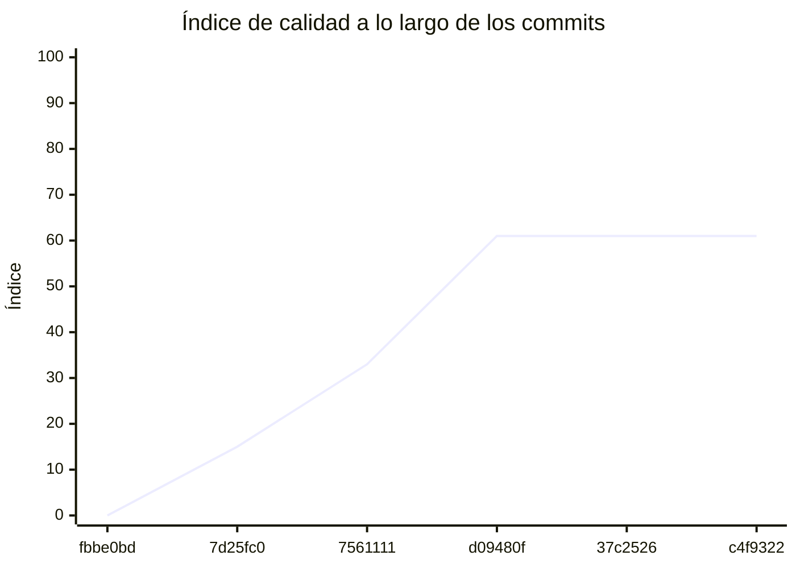

<!-- evaluacion:inicio -->
# Evaluación — prog2rupcic/backend-catalogo

> Documento **generado automáticamente** por la cátedra de Programación II (UM): RepoSense + análisis de calidad de **7 dimensiones**. **No editar a mano**: se regenera en cada evaluación.
> Rama evaluada: `main`. Análisis **heurístico** (regex + métricas) + build: es una criba para orientar la revisión, **no una nota**. La **documentación** del repositorio no se evalúa.
> Generado: 2026-11-17.

## 1. Veredicto

| Aspecto | Resultado |
|---|---|
| Índice de calidad | **61/100** |
| Tipo de repositorio | `backend` |
| Build (`mvnw verify` / `gradlew check`) | OK |
| Código (LOC) | 3,357 |
| Archivos de código | 77 |
| Clases | 106 |
| Código dentro de clases (%POO) | 80% |
| Funciones fuera de clases | 0 |
| Duplicación (puerta) | 0.9% |
| Duplicación lógica | 0.9% |
| Duplicación de boilerplate | 3.8% |
| Cobertura | 95% |
| Tope duro aplicado a D1 | `POO_BAJO` → D1 ≤ 60 |

> Este informe **describe** lo que el análisis midió con los criterios ya establecidos de la materia. No es una nota.

## 2. Semáforo de aprobación

Criterios de la cátedra (`CRITERIOS-CALIDAD.md`): **Aprobar** se juega con el perfil `estandar`; **destacar**, con el `exigente` (meta de excelencia).

| Semáforo | Resultado |
|---|---|
| Aprobar (`estandar`) | **no cumple** — 7/11 |
| Destacar (`exigente`) | **no cumple** — 5/11 |

**Para aprobar, falta cumplir:** Tests

**Para destacar, falta cumplir:** SOLID; POO; Tests

## 3. Autoría (RepoSense)

| Autor | Commits | Código (LOC) | Tests (LOC) | Docs (LOC) | Días activos | % del código |
|---|---:|---:|---:|---:|---:|---:|
| Juan Cruz Rupcic | 19 | 1,961 | 1,828 | 159 | 14 | 100% |

> _El LOC de autoría lo calcula RepoSense sobre el historial y puede diferir del LOC de código del análisis (que mira el estado de `main`)._

## 4. Dimensiones evaluadas

Cada dimensión indica **qué mide**, **por qué importa** y **tu resultado**. Cuando el puntaje queda por debajo de la referencia, se agregan preguntas para **investigar la causa** (no hay recetas).

| Dimensión | Peso | Puntaje |
|:--|--:|--:|
| **D1** Diseño OO, SOLID y patrones (20%) | 20% | 6 |
| **D2** Arquitectura hexagonal — backend (15%) | 15% | 100 |
| **D3** Frontend KMP: MVVM y buenas prácticas (10%) | 10% | N/A |
| **D4** Integración y contrato (10%) | 10% | 60 |
| **D5** Seguridad y robustez (10%) | 10% | 100 |
| **D6** Pruebas y cobertura (20%) | 20% | 40 |
| **D7** Proceso y entrega (15%) | 15% | 100 |

### D1. Diseño OO, SOLID y patrones (20%)

- **Qué mide:** Métricas orientadas a objetos (clases, métodos, campos, cohesión, acoplamiento, herencia) y proxies de SOLID, más patrones de diseño.
- **Por qué importa:** El eje de la materia es el buen uso de la POO y su arquitectura: un diseño con clases claras y poco acopladas es más fácil de entender, probar y cambiar.
- **Tu resultado:** **6/100**
- **Para investigar la causa:**
    - ¿Se pensó el modelo de clases antes de codificar o se agrupó después?
    - ¿Qué clases concentran muchas responsabilidades a la vez?
    - ¿Los colaboradores llegan como parámetros o se crean por dentro?

### D2. Arquitectura hexagonal — backend (15%)

- **Qué mide:** Separación en capas (dominio, puertos de entrada/salida, adaptadores) y dirección de las dependencias del backend.
- **Por qué importa:** Aislar el dominio de la infraestructura permite cambiar la base de datos, el framework o el transporte sin tocar las reglas de negocio.
- **Tu resultado:** **100/100**

### D4. Integración y contrato (10%)

- **Qué mide:** Cumplimiento del contrato de integración de la cátedra (formato de errores, paginación, autenticación, endpoints esperados).
- **Por qué importa:** Los servicios deben poder integrarse entre sí y con la app sin sorpresas; el contrato es lo que hacen cumplir las pruebas de integración.
- **Tu resultado:** **60/100**

### D5. Seguridad y robustez (10%)

- **Qué mide:** Credenciales embebidas, consultas SQL por concatenación, y presencia de config de entorno; aislamiento de secretos.
- **Por qué importa:** Un secreto en el repositorio o una consulta construida por concatenación son riesgos concretos, no hipotéticos.
- **Tu resultado:** **100/100**

### D6. Pruebas y cobertura (20%)

- **Qué mide:** Cantidad y resultado de pruebas y cobertura de línea (JaCoCo/Kover, Surefire/Failsafe) cuando hay build.
- **Por qué importa:** Las pruebas son la red de seguridad para refactorizar e integrar; la cobertura acota las zonas sin verificar.
- **Tu resultado:** **40/100**
- **Para investigar la causa:**
    - ¿Qué partes del sistema no tienen pruebas?
    - ¿Las pruebas cubren caminos de error o solo el caso feliz?
    - ¿Qué falla al ejecutar la suite completa (no solo la del módulo propio)?

### D7. Proceso y entrega (15%)

- **Qué mide:** Artefactos verificables de proceso/entrega: `compose`, `.env.example`, CI (`.github/workflows/`), `CODEOWNERS` y wrapper de build (`mvnw`/`gradlew`). **No** puntúa documentación.
- **Por qué importa:** Un proyecto que compila, se levanta y se valida solo es más fácil de revisar y de integrar en equipo.
- **Tu resultado:** **100/100**

## 5. Señales detectadas

El análisis encontró las siguientes señales (archivo, sin número de línea a propósito):

**DIP/concretos** (29)
- clase 'CatalogSecurityConfiguration' muy acoplada (CBO=23) — `src/main/java/ar/edu/turnos/catalogo/config/CatalogSecurityConfiguration.java`
- clase 'CatalogSecurityConfiguration' instancia 4 concretos (CBO=23) — `src/main/java/ar/edu/turnos/catalogo/config/CatalogSecurityConfiguration.java`
- clase 'CatalogChangesRedisAdapter' muy acoplada (CBO=22) — `src/main/java/ar/edu/turnos/catalogo/catalogo/infrastructure/redis/CatalogChangesRedisAdapter.java`
- clase 'CatalogChangesRedisAdapter' instancia 9 concretos (CBO=22) — `src/main/java/ar/edu/turnos/catalogo/catalogo/infrastructure/redis/CatalogChangesRedisAdapter.java`
- clase 'CatalogRedisHealthIndicator' muy acoplada (CBO=9) — `src/main/java/ar/edu/turnos/catalogo/catalogo/infrastructure/redis/CatalogRedisHealthIndicator.java`
- clase 'CatalogReconciliationJob' muy acoplada (CBO=20) — `src/main/java/ar/edu/turnos/catalogo/catalogo/infrastructure/bootstrap/CatalogReconciliationJob.java`
- clase 'CatalogFailureClassifier' muy acoplada (CBO=10) — `src/main/java/ar/edu/turnos/catalogo/catalogo/infrastructure/bootstrap/CatalogFailureClassifier.java`
- clase 'CatalogDiagnosticsRecorder' muy acoplada (CBO=22) — `src/main/java/ar/edu/turnos/catalogo/catalogo/infrastructure/bootstrap/CatalogDiagnosticsRecorder.java`
- clase 'CatedraSnapshotRestAdapter' muy acoplada (CBO=19) — `src/main/java/ar/edu/turnos/catalogo/catalogo/infrastructure/rest/CatedraSnapshotRestAdapter.java`
- clase 'CatedraSnapshotRestAdapter' instancia 4 concretos (CBO=19) — `src/main/java/ar/edu/turnos/catalogo/catalogo/infrastructure/rest/CatedraSnapshotRestAdapter.java`
- clase 'CatalogSnapshotJdbcAdapter' muy acoplada (CBO=31) — `src/main/java/ar/edu/turnos/catalogo/catalogo/infrastructure/persistence/jdbc/CatalogSnapshotJdbcAdapter.java`
- clase 'CatalogDiagnosticJdbcAdapter' muy acoplada (CBO=39) — `src/main/java/ar/edu/turnos/catalogo/catalogo/infrastructure/persistence/jdbc/CatalogDiagnosticJdbcAdapter.java`
- clase 'ProfessionalAgendaJdbcAdapter' muy acoplada (CBO=26) — `src/main/java/ar/edu/turnos/catalogo/catalogo/infrastructure/persistence/jdbc/ProfessionalAgendaJdbcAdapter.java`
- clase 'ProfessionalSearchJdbcAdapter' muy acoplada (CBO=29) — `src/main/java/ar/edu/turnos/catalogo/catalogo/infrastructure/persistence/jdbc/ProfessionalSearchJdbcAdapter.java`
- clase 'CatalogUpdatedKafkaListener' muy acoplada (CBO=16) — `src/main/java/ar/edu/turnos/catalogo/catalogo/infrastructure/messaging/CatalogUpdatedKafkaListener.java`
- clase 'CatalogKafkaLifecycle' muy acoplada (CBO=9) — `src/main/java/ar/edu/turnos/catalogo/catalogo/infrastructure/messaging/CatalogKafkaLifecycle.java`
- clase 'ProfessionalSearchController' muy acoplada (CBO=10) — `src/main/java/ar/edu/turnos/catalogo/catalogo/infrastructure/web/controller/ProfessionalSearchController.java`
- clase 'ProfessionalAgendaController' muy acoplada (CBO=8) — `src/main/java/ar/edu/turnos/catalogo/catalogo/infrastructure/web/controller/ProfessionalAgendaController.java`
- clase 'CatalogDiagnosticsResponse' muy acoplada (CBO=8) — `src/main/java/ar/edu/turnos/catalogo/catalogo/infrastructure/web/dto/CatalogDiagnosticsResponse.java`
- clase 'CatalogDiagnosticsUseCaseImpl' muy acoplada (CBO=14) — `src/main/java/ar/edu/turnos/catalogo/catalogo/application/usecases/CatalogDiagnosticsUseCaseImpl.java`
- clase 'RebuildCatalogUseCaseImpl' muy acoplada (CBO=8) — `src/main/java/ar/edu/turnos/catalogo/catalogo/application/usecases/RebuildCatalogUseCaseImpl.java`
- clase 'ApplyCatalogIncrementUseCaseImpl' muy acoplada (CBO=8) — `src/main/java/ar/edu/turnos/catalogo/catalogo/application/usecases/ApplyCatalogIncrementUseCaseImpl.java`
- clase 'SearchProfessionalsUseCaseImpl' muy acoplada (CBO=9) — `src/main/java/ar/edu/turnos/catalogo/catalogo/application/usecases/SearchProfessionalsUseCaseImpl.java`
- clase 'ApplyCatalogSnapshotUseCaseImpl' muy acoplada (CBO=8) — `src/main/java/ar/edu/turnos/catalogo/catalogo/application/usecases/ApplyCatalogSnapshotUseCaseImpl.java`
- clase 'GetProfessionalAgendaUseCaseImpl' muy acoplada (CBO=10) — `src/main/java/ar/edu/turnos/catalogo/catalogo/application/usecases/GetProfessionalAgendaUseCaseImpl.java`
- clase 'SynchronizeCatalogUseCaseImpl' muy acoplada (CBO=25) — `src/main/java/ar/edu/turnos/catalogo/catalogo/application/usecases/SynchronizeCatalogUseCaseImpl.java`
- clase 'CatalogValidation' muy acoplada (CBO=9) — `src/main/java/ar/edu/turnos/catalogo/catalogo/domain/model/CatalogValidation.java`
- clase 'CatalogValidation' instancia 4 concretos (CBO=9) — `src/main/java/ar/edu/turnos/catalogo/catalogo/domain/model/CatalogValidation.java`
- clase 'CatalogDiagnostic' muy acoplada (CBO=24) — `src/main/java/ar/edu/turnos/catalogo/catalogo/domain/model/CatalogDiagnostic.java`

**SRP/responsabilidad** (21)
- clase 'CatalogChangesRedisAdapter' grande (LOC=64, métodos=13, campos=2) — `src/main/java/ar/edu/turnos/catalogo/catalogo/infrastructure/redis/CatalogChangesRedisAdapter.java`
- método 'CatalogChangesRedisAdapter.CatalogHistory' de 31 líneas — `src/main/java/ar/edu/turnos/catalogo/catalogo/infrastructure/redis/CatalogChangesRedisAdapter.java`
- clase 'CatalogReconciliationJob' grande (LOC=87, métodos=4, campos=10) — `src/main/java/ar/edu/turnos/catalogo/catalogo/infrastructure/bootstrap/CatalogReconciliationJob.java`
- clase 'CatalogReconciliationJob' con baja cohesión (33%) — `src/main/java/ar/edu/turnos/catalogo/catalogo/infrastructure/bootstrap/CatalogReconciliationJob.java`
- método 'CatalogReconciliationJob.runCycle' de 35 líneas — `src/main/java/ar/edu/turnos/catalogo/catalogo/infrastructure/bootstrap/CatalogReconciliationJob.java`
- método 'CatalogReconciliationJob.runCycle' con complejidad 6 — `src/main/java/ar/edu/turnos/catalogo/catalogo/infrastructure/bootstrap/CatalogReconciliationJob.java`
- clase 'CatalogSnapshotJdbcAdapter' grande (LOC=71, métodos=10, campos=3) — `src/main/java/ar/edu/turnos/catalogo/catalogo/infrastructure/persistence/jdbc/CatalogSnapshotJdbcAdapter.java`
- clase 'CatalogSnapshotJdbcAdapter' con baja cohesión (47%) — `src/main/java/ar/edu/turnos/catalogo/catalogo/infrastructure/persistence/jdbc/CatalogSnapshotJdbcAdapter.java`
- clase 'CatalogDiagnosticJdbcAdapter' grande (LOC=68, métodos=12, campos=1) — `src/main/java/ar/edu/turnos/catalogo/catalogo/infrastructure/persistence/jdbc/CatalogDiagnosticJdbcAdapter.java`
- clase 'CatalogUpdatedKafkaListener' con baja cohesión (17%) — `src/main/java/ar/edu/turnos/catalogo/catalogo/infrastructure/messaging/CatalogUpdatedKafkaListener.java`
- método 'ProfessionalSearchResponse.Professional' con 5 parámetros — `src/main/java/ar/edu/turnos/catalogo/catalogo/infrastructure/web/dto/ProfessionalSearchResponse.java`
- método 'Professional.Professional' con 5 parámetros — `src/main/java/ar/edu/turnos/catalogo/catalogo/infrastructure/web/dto/ProfessionalSearchResponse.java`
- clase 'SynchronizeCatalogUseCaseImpl' con baja cohesión (30%) — `src/main/java/ar/edu/turnos/catalogo/catalogo/application/usecases/SynchronizeCatalogUseCaseImpl.java`
- método 'SynchronizeCatalogUseCaseImpl.reconcileInternal' de 40 líneas — `src/main/java/ar/edu/turnos/catalogo/catalogo/application/usecases/SynchronizeCatalogUseCaseImpl.java`
- método 'SynchronizeCatalogUseCaseImpl.reconcileInternal' con complejidad 8 — `src/main/java/ar/edu/turnos/catalogo/catalogo/application/usecases/SynchronizeCatalogUseCaseImpl.java`
- método 'ProfessionalSearch.Filter' con 6 parámetros — `src/main/java/ar/edu/turnos/catalogo/catalogo/domain/model/ProfessionalSearch.java`
- método 'ProfessionalSearch.Filter' con complejidad 6 — `src/main/java/ar/edu/turnos/catalogo/catalogo/domain/model/ProfessionalSearch.java`
- método 'ProfessionalSearch.Professional' con 5 parámetros — `src/main/java/ar/edu/turnos/catalogo/catalogo/domain/model/ProfessionalSearch.java`
- método 'Filter.Filter' con 6 parámetros — `src/main/java/ar/edu/turnos/catalogo/catalogo/domain/model/ProfessionalSearch.java`
- método 'Filter.Filter' con complejidad 6 — `src/main/java/ar/edu/turnos/catalogo/catalogo/domain/model/ProfessionalSearch.java`
- método 'Professional.Professional' con 5 parámetros — `src/main/java/ar/edu/turnos/catalogo/catalogo/domain/model/ProfessionalSearch.java`

**OCP/type-switch** (2)
- clase 'CatalogFailureClassifier' con 9 type-checks — `src/main/java/ar/edu/turnos/catalogo/catalogo/infrastructure/bootstrap/CatalogFailureClassifier.java`
- clase 'CatalogDiagnosticsRecorder' con 6 type-checks — `src/main/java/ar/edu/turnos/catalogo/catalogo/infrastructure/bootstrap/CatalogDiagnosticsRecorder.java`

## 6. Evolución por commit

Métricas calculadas sobre el estado de `main` en **cada commit** (6 commits con trabajo), del primero al último. La calidad usa el perfil `exigente`; el aporte de código lo mide RepoSense. El índice puede **bajar** al crecer el proyecto: se acumulan señales.

```mermaid
xychart-beta
    title "Índice de calidad a lo largo de los commits"
    x-axis ["fbbe0bd", "7d25fc0", "7561111", "d09480f", "37c2526", "c4f9322"]
    y-axis "Índice" 0 --> 100
    line [0, 15, 33, 61, 61, 61]
```

| # | Fecha | Commit | Autor | LOC | Índice | %POO | Duplic. | Sueltas |
|---|---|---|---|---:|---:|---:|---:|---:|
| 1 | 2026-09-07 | `fbbe0bd` | juancruz0912 | 0 | 0 | 0% | 0.0% | 0 |
| 2 | 2026-09-15 | `7d25fc0` | Ing. Daniel Quinteros | 0 | 15 | 0% | 0.0% | 0 |
| 3 | 2026-10-13 | `7561111` | Juan Cruz Rupcic | 18 | 33 | 56% | 0.0% | 0 |
| 4 | 2026-11-02 | `d09480f` | Juan Cruz Rupcic | 3,357 | 61 | 80% | 0.9% | 0 |
| 5 | 2026-11-02 | `37c2526` | Juan Cruz Rupcic | 3,357 | 61 | 80% | 0.9% | 0 |
| 6 | 2026-11-04 | `c4f9322` | Juan Cruz Rupcic | 3,357 | 61 | 80% | 0.9% | 0 |

---
_Informe generado por la cátedra. Las dimensiones y umbrales corresponden a `calidad.py` (perfil `exigente`); el semáforo, a `CRITERIOS-CALIDAD.md`. La documentación del repositorio no se evalúa. Ante dudas, revisá el archivo señalado._
<!-- evaluacion:fin -->
